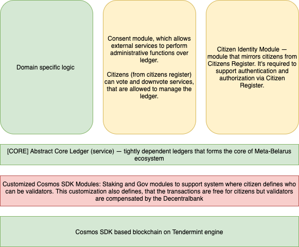
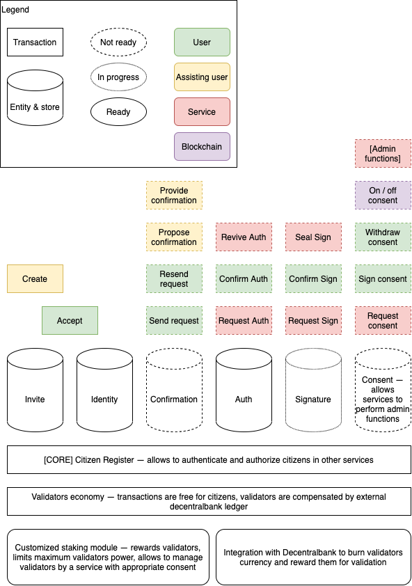

# Meta-Belarus Core Ecosystem
## Introduction
### Meta-Belarus Ecosystem
Meta-Belarus is an ecosystem of services and ledgers, that should automate self-governance for Belarusian society based on direct and liquid democracy.

Our main approach is not to mirror the existing delegative democracies, that stands on document based bureaucracies, but to rebuild everything based on internet information flow and structures, leveraging total destruction of rights and government institutes in Republic of Belarus.

### Meta-Belarus Core Ecosystem
Meta-Belarus Core is a minimal set of basic services that are required to organize scalable self-government.

Core services includes:
1. Citizen Register
2. Voting System
3. Initiatives and Decisions System
4. Fiscal System
5. Decentral Bank

Principles that Meta-Belarus Core is based on:
1. Decentralization — all core services are decentralized ledgers;
2. Users manage admins — users vote for and downvote services that allowed to have administrative rights in the core;
3. Free for users — transactions in ledgers are free for users, Decentral bank rewards infrastructure providers (Validators)

## Meta-Belarus Core
This sections provides short overview of core services.
### Overview
Every service in the core is a crypto-governance blockchain ledger. Main peculiarities of such ledgers is that they are not self sufficient. 

* The economy of such ledger is based on the Decentral bank capabilities, that should be fueled by the Fiscal system and external funds, that are linked to the core as external services.
* Initiatives and decision system relays on the Voting system and can lead to registration of new services with admin capabilities (that should represent gov. organizations, foundations, etc.)
* Fiscal System uses Decentral bank to operate Meta-Belarus currency.
* Citizen Register provides authentication and identification data for the core services.

### Abstract Core Ledger 
Every Core Service has common architecture:

It has:
1. A mechanism to register external services as a gov. services with admin rights in the ledger. 
2. A module that allows to legitimise transactions only by citizens from the citizen register.
3. Set of customized modules of the Cosmos SDK, that supports crypto-gov economy.

Every core service is based on Cosmos SDK and Tendermint BFT engine.

### Citizen Register
Citizen Register represents the ledger that contains people IDs.

Its main responsibilities are:
1. To guaranty identity and deduplication of citizens to protect from abuse of Meta-Belarus services and core by intruders;
2. To provide verifiable data about citizens that can be used by other services;

### Voting system
Voting system represents the ledger that allows to manage and protect voting about any decision in the society.

Its main responsibilities are:
1. To organize voting by any Meta-Belarus participant with clearly regulated requirements;
2. To provide voting capability for citizens;
3. To guaranty protection of voting from intruders;

### Initiatives and Decisions System
Initiatives and Decisions System is required to help people and organizations to start initiatives from courtyard improvments and law changes to intercity road building and foreign policy decisions.

Its main purposes are:
1. To define and automatize the process of an initiative definition and discussion;
2. To define quorum for voting for decision or initiative and provide input for voting system;
3. To help organizing funding and executive comity;
4. To provide clear report about progress and performance to the interested persons;

### Fiscal system
Fiscal System is a service that regulates financial and tax relations between participant of economy transactions (including Meta-Belarus as a governance entity).

Its main purposes are:
1. To define the product and service in categories of tax and law;
2. To register transactions and distribute payments and fees between participating parties (including taxation);
3. To guaranty instant deductions to appropriate foundations and initiatives;

### Decentral bank
Decentral Bank is an entity that issues and regulates Meta-Belarus currency. 

Its main purposes are:
1. Issuing and regulation Meta-Belarus currency based on the capabilities of the economy and linked funds;
2. To collect taxes to support Meta-Belarus core and non-core services;
3. To reward infrastructure holdres (validators) of core and non-core services;

## Citizen Register
Right now we are in the process of development of Citizen Register ledger.

Citizen Register Service is a basic service of Meta-Belarus core. Its main responsibility is identification of citizens and prevention of intrusions in the Meta-Belarus Core using malicious practices like: duplication of accounts and false-identity.

### Architecture of Citizen Register

### Stages of Citizen register development
Citizen register as a blockchain should go to some development stages before it becomes fully operational.
1. Genesis stage — when the blockchain starts and the first seeding accounts with extended number of invites appears;
2. Seed stage — when first invited users come and validated via internal mechanisms of the Register. On this stage validators are limited by trusted number of infrastructure owners. Some updates of software can be done fast, the network can be managed by developers;
3. Launch stage — when internal mechanisms are replaced by external services; Some external gov services are chosen by citizens to manage identity registration process and to grant new validators their power;
4. Freeflight stage - developers lose rights to gov functions; Register is govern by external services which receive rights from citizens; 

### Mechanisms of Citizen Identity 
#### Invite users [Implemented on 01/07/2020 (US date)]
On the seed stage of the Register launch new users can only be invited by existing citizens. This limits number of potential intruders, because invites are limited and can be restored only with time. Invites from the genesis stage are privileged and allows to create identities with different level of approve and number of invites depending on handshake distance from seed accounts.
#### Confirm users
To replace central gov who confirm identity of a user, the identity owner should receive a number of confirmations from random geo neighbors, who can physically or virtually validate new identity owner. Before appropriate number of confirmations is received the user can use influencing functions of the register: invites, confirmations, voting for gov rights for external services etc.

Confirmations are expired with time and need to be reclaimed to sustain received rights in the register. This makes it harder for potential intruders to build bot-nets. Plus it allows additionally identify clusters of intruder's identities.
#### Consent administrative  rights for external services
External service can request rights to govern the Register. If majority of active citizens grants these rights. The service can initiate administrative transactions for its account. Some share of citizens can downvote misbehaving service at any time to remove granted governance rights.
#### Identity signatures
Any external services can provide a document or a record to a citizen, that can be signed by the citizen and included to his or her identity. It provides two main mechanisms of the register: identity confirmation by external services (KYC), and validated self-sovereign identity records, that can be consequentially used by 3rd service as input for decision (e.g. information about high education, special medial conditions, or trust for credit institutions, etc.)
### Identity authentication
External service can authenticate and authorize users by their identity in the register in the oAuth like manner.
#### Replacement of identity registration and verification process by external KYC
This is a partially emergent property of the register mechanisms. External services with special gov. rights can get permissions to create and verify identities around Invitation-Confirmations mechanism of the Register. It will make system more scalable in terms of user adoption and reduce ownership efforts of full-rights Identity in the citizen register. Presence of such a tool or tools is a prerequisite of lunch stage of the Register. 

### Main Use-Case of Citizen Register
#### Positive flow from the citizen perspective — Seed stage 
1. An existing citizen generates invite for a potential user;
2. Potential user activate invite and gets his Identity and the Account as number of mnemonics and his or her private key and address. The account grants access to identity. At this state identity can be used to authenticate in any external service via authentication mechanism.
3. A Citizen can login to external service (e.g. voting system)
4. The external service (e.g. voting service) can send a document for sign by the user to prove validity of the document (e.g. ballot paper)
5. The citizen can sign the document

#### Positive flow from the KYC enabled service perspective
1. A citizen can request a service from an external entity (e.g. issuing a bank card)
2. External entity can check if the citizen has appropriate KYC signature
3. If the citizen doesn't have one, the service employees can verify the citizen and send a KYC badge to his or her identity for further automated checks
4. Another service can request this or another KYC badge to prove citizen's identity 

#### Positive flow from the gov level service perspective
Let's consider service that represents Identity governance.
1. A potential user makes a request to the service
2. The service passes the user through KYC procedure
3. The service create an Identity that doesn't require confirmation by other citizens and has rights to use internal register functions (vote for services, invite new citizens, etc.)

### Transactions of Citizen Register
This section is represented by CLI Client of the Citizen Register Ledger
#### Creates a new invite [IMPLEMENTED]
Usage:
`mbcorecr tx mbcorecr create-invite [Level: Level0/Level1/Level2/Level3/Level4/LevelSuper] [Identity Type: CITIZEN/FOREIGNER/DIASPORA_MEMBER/SERVICE] [flags]`

* Level - Level of seed invite used. Non seed accounts have only level4 invites. It defines which set of invites and level of default confirmation will be received by the generated identity. 
* Identity Type — defines the role of the identity in the system. CITIZEN is the target type for most cases.
* --from - is a mandatory flag that defines an account private key from the local keychain.
* .Response - json payload that is encrypted with "from" account public key in the ledger. Should be decrypted with "from" account private key to be used. Contains Invite ID and Activation sequence (key).

Positive test can be found [here](https://github.com/markvandal/metabelarus.core.cr/blob/mbcoorbot/dev/scripts/test_all.sh)

#### Accept a new invite [IMPLEMENTED]
Usage:
`mbcorecr tx mbcorecr accept-invite [Invite Id] [Sequence] [flags]`

* Invite Id, Sequence — id of invite and activation key
* .Response — yaml payload with encrypted identity account info (mnemonics, address, public key private key), that is locally (with the key from local keychain) unencrypted.

Positive test can be found [here](https://github.com/markvandal/metabelarus.core.cr/blob/mbcoorbot/dev/scripts/test_all.sh)

#### Manage auth
`mbcorecrd tx crsign [create/sign/revive/cancel]-auth`

Set of commands that allows the service and the user establish trusted authentication in the service

#### Manage signatures
`mbcorecr tx crsign [create/sign/seal/reject/withdraw]-signature`

Set of commands that allows to link documents and records for the identity by an external service.

### Further Development and Additional Software
Right now the Citizen register requires the following major developments outside the functional scope of the ledger (and other core ledgers) itself:
1. We need a wallet to sign transactions in the Meta-Belarus ledgers. We consider some react-native based solution that is developed around javascript client sdk for cosmos/tendermint based ledgers. It will allow to create three types of wallet: 
   1. mobile app; 
   2. browser extension; 
   3. integrated wallet for web services, that will allow to use private key without additionally software installed right on the web clients without risk of exposing private key and/or mnemonics.
2. Cosmos SDK stacking module customization to support crypto-government blockchain economy.